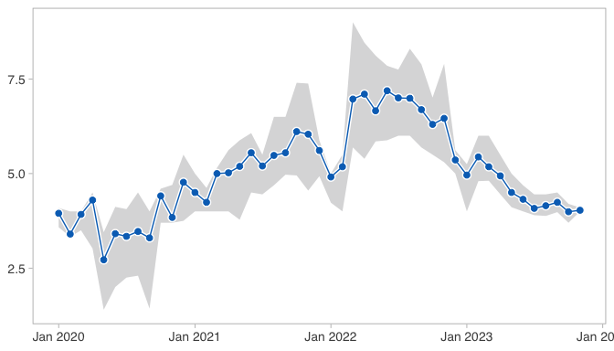

<!-- README.md is generated from README.Rmd. Please edit that file -->

# encuestasmacro

<!-- badges: start -->

[](https://github.com/encuestas-macro/encuestasmacro/actions/workflows/R-CMD-check.yaml)
<!-- badges: end -->

Tools for processing and analysis of the Macroeconomic Surveys of the
Central Bank of the Dominican Republic.

## Installation

You can install the development version of `encuestasmacro` with the
following command:

``` r
remotes::install_github("encuestas-macro/encuestasmacro")
```

## How to use

In the package you’ll find the data of the macroeconomic surveys, as
well as functions to explore and visualized the results. Let’s see how
we can explore the Macroeconomic Expectations Survey with the
`encuestasmacro` package.

1.  Get the data in wide or long format

``` r
eem_wide <- example_eem_data(format = "wide")
eem_long <- example_eem_data(format = "long")
```

``` r
head(eem_long)
#> # A tibble: 6 × 9
#>   periodo     year   mes id_colaborador grupo  variable variable_label horizonte
#>   <date>     <dbl> <dbl>          <int> <chr>  <chr>    <fct>          <fct>    
#> 1 2009-06-01  2009     6             64 Bancos inflaci… Inflación      Fin de m…
#> 2 2009-06-01  2009     6             64 Bancos inflaci… Inflación      Fin de a…
#> 3 2009-06-01  2009     6             64 Bancos inflaci… Inflación      12 meses 
#> 4 2009-06-01  2009     6             64 Bancos inflaci… Inflación      Fin año …
#> 5 2009-06-01  2009     6             64 Bancos inflaci… Inflación      24 meses 
#> 6 2009-06-01  2009     6             64 Bancos tc       Tipo de cambio Fin de m…
#> # ℹ 1 more variable: value <dbl>
```

2.  Plot the results with the plotting functions

**12 month inflation expectations**

``` r
eem_wide |>
  eem_boxplot(
    variable = "inflacion_interanual",
    font_family = "sans"
  )
```

<!-- -->

``` r
eem_long |>
  eem_ribbon_plot(
    "inflacion",
    font_family = "sans",
    color = colores_em("blue")
  )
```

<!-- -->

**Real GDP growth by the end of the year**

``` r
eem_wide |>
  eem_boxplot(
    variable = "pib_diciembre",
    font_family = "sans",
    color = colores_em("green")
  )
```

<!-- -->
